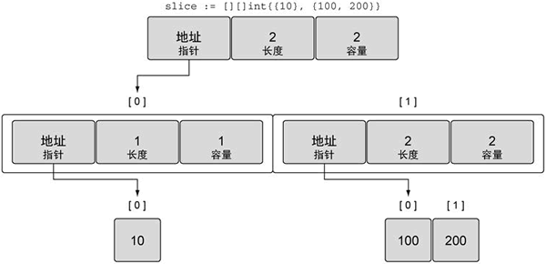

## Go语言多维切片

Go语言中同样允许使用多维切片，声明一个多维数组的语法格式如下：var sliceName \[\]\[\]...\[\]sliceType

其中，sliceName 为切片的名字，sliceType为切片的类型，每个 `[ ]` 代表着一个维度，切片有几个维度就需要几个 `[ ]` 。

下面以二维切片为例，声明一个二维切片并赋值，代码如下所示。

```
//声明一个二维切片
var slice [][]int
//为二维切片赋值
slice = [][]int{{10}, {100, 200}}
```

上面的代码也可以简写为下面的样子。

```
// 声明一个二维整型切片并赋值
slice := [][]int{{10}, {100, 200}}
```

上面的代码中展示了一个包含两个元素的外层切片，同时每个元素包又含一个内层的整型切片，切片 slice 的值如下图所示。



图：整型切片的切片的值

通过上图可以看到外层的切片包括两个元素，每个元素都是一个切片，第一个元素中的切片使用单个整数 10 来初始化，第二个元素中的切片包括两个整数，即 100 和 200。

这种组合可以让用户创建非常复杂且强大的 数据结构 ，前面介绍过的关于内置函数 [append()](./images/02_08_02.png) 的规则也可以应用到组合后的切片上，如下所示。

【示例】组合切片的切片

```
// 声明一个二维整型切片并赋值
slice := [][]int{{10}, {100, 200}}
// 为第一个切片追加值为 20 的元素
slice[0] = append(slice[0], 20)
```

Go语言里使用 append() 函数处理追加的方式很简明，先增长切片，再将新的整型切片赋值给外层切片的第一个元素，当上面代码中的操作完成后，再将切片复制到外层切片的索引为 0 的元素，如下图所示。

图：append 操作之后外层切片索引为 0 的元素的布局

即便是这么简单的多维切片，操作时也会涉及众多的布局和值，在函数间这样传递数据结构会很复杂，不过切片本身结构很简单，可以用很小的成本在函数间传递。